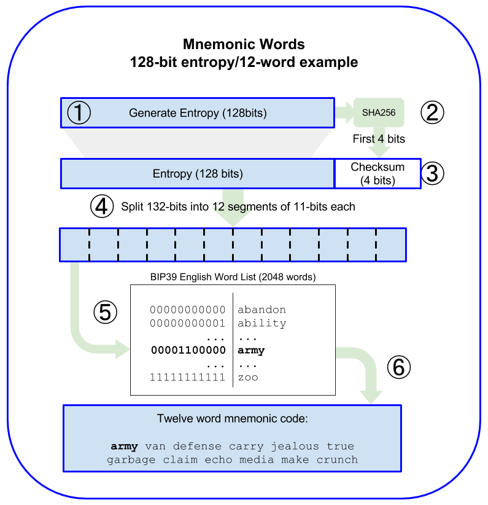
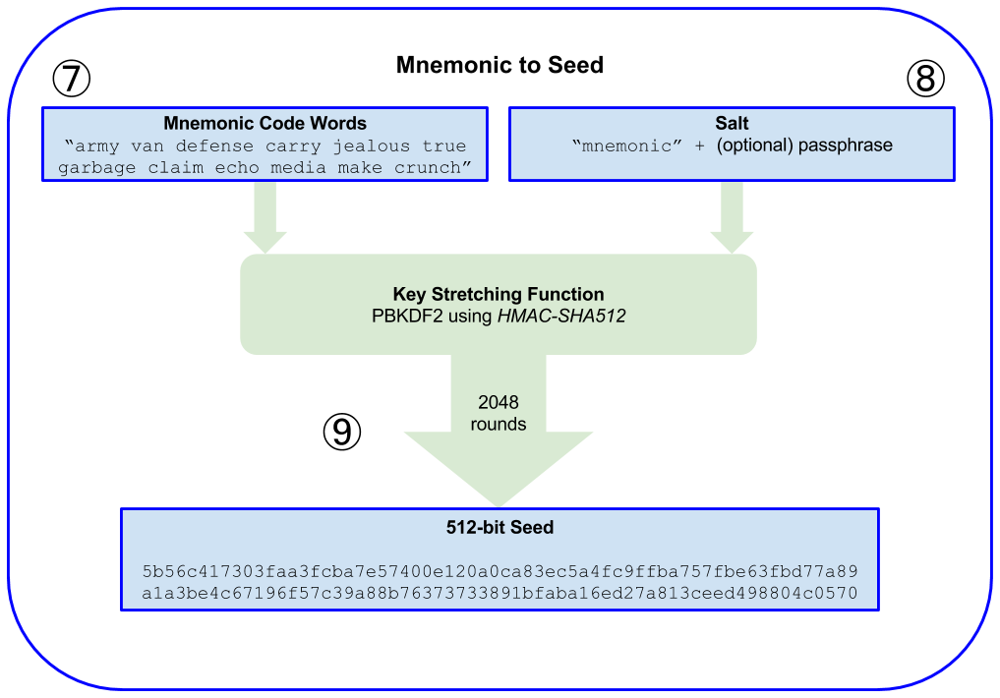

# 💲 지갑

- 넓은 의미에서 지갑은 이더리움의 주요 사용자 잉ㄴ터페이스를 제공하는 소프트웨어 어플리케이션이다.

- 개발자의 시각으로 좁혀보면, 지갑이란 단어는 사용자의 키를 보관하고 관리하기 위해 사용되는 시스템을 의미하며, 모든 지갑은 키 관리 구성요소를 갖고 있다.

- 좀 더 넓은 범주에서 이더리움 기반 탈중앙화 애플리케이션의 인터페이스인 브라우저의 일부이거나, 댑의 한 부분인 지갑도 있다.

- 이번 장에서는 개인키를 담는 공간이자 키를 관리하는 시스템으로서의 지갑을 살펴본다.

## #️⃣ 지갑 기술의 개요

- 지갑을 설계할 때 가장 중요한 고려사항 중 하나는 편의성과 프라이버스 사이에 균형을 맞추는 것이다.

- 매우 엄격하게 말하자면 지갑은 단지 키만 보유한다.

- 이더리움 지갑은 **키체인**이다.

- 중요한 것은 기존 은행의 중앙화된 시스템을 다루는 것에서부터 블록체인 플랫폼의 탈중앙화된 시스템으로 사고방식을 바꾸는 것이다.

- 지갑의 첫 번째 유형은 각기 다른 무작위 수로부터 각각의 키를 무작위적으로 추출하는 **비결정적 지갑(nondeterministic wallet)** 이다.

- 두 번째 유형은 모든 키가 시드(seed)라고 하는 단일 마스터 키로부터 파생된 **결정적 지갑(deterministic wallet)** 이다.

### 0️⃣ 비결정적 지갑

- 지갑 파일에 무작위로 추출된 단일 개인키를 저장, 여러 측면에서 불편하기 때문에 결정적 지갑으로 대체되고 있음.

- 때마다 모두 새로운 주소를 위한 새로운 지갑파일을 만들기 때문에 다루기가 가장 어렵다.

- 그럼에도 불구하고 많은 이더리움 클라이언트(게스 포함)은 보안 강화를 위해 암호문으로 암호화된 단일(무작위로 생성된)개인키가 들어 있는, JSON 인코딩 파일인 키저장소 파일을 사용한다.

### 1️⃣ 결정적 지갑

- 결정적 혹은 시드 지갑은 단일 마스터 키 또는 단일 시드로부터 파생된 개인키를 포함하고 있다.

- 결정적 지갑에서 시드는 모든 파생된 키를 복구할 수 있다.

### 2️⃣ HD지갑 (BIP-32/BIP-44)

- 결정적 지갑은 단일 시드로부터 아주 많은 키를 쉽게 추출하기 위해 개발되었다.

- 현재 가장 개선된 결정적 지갑은 비트코인의 **BIP-32 표준**으로 정의된 HD(hierarchical deterministic)지갑이다.

- HD지갑은 트리 구조로 파생된 키들을 가지고 있다. 이러한 구조는 부모 키가 자식의 키의 시퀀스를 파생할 수 있고, 각각의 자식은 다시 또 손자 키의 시퀀스를 파생할 수 있다.

- 👍 사용 목적에 따라 다른 분기를 할당하여 기업 환경 설정과 같은 구조적인 의미를 표현하는데도 사용할 수 있다.

- 👍 개인키에 접속하지 않고 사용자가 공개키 시퀀스를 만들수도 있다.

### 3️⃣ 시드와 니모닉 코드 (BIP-39)

- 올바른 순서로 단어 시퀀스가 입력되면 고유한 개인키를 다시 만들수 있는 방법을 _**니모닉(mnemonic)**_ 이라 하고, 이러한 접근은 **BIP-39**에 의해 표준화 되었다.

- 실용적인 측면에서, 16진수 시퀀스를 기록할 때는 오류가 발생할 확률이 매우 높다.

- HD 지갑의 인코딩을 위한 복구 단어 목록을 사용하는 것이 오류 없이 고쳐 쓰고, 종이에 기록하고, 읽고, 안전하게 내보내고, 개인키들을 다른 지갑으로 가져오는 가장 쉬운 방법이다.

## #️⃣ 지갑의 모범 사례

- BIP-39 기반 니모닉 코드 단어

- BIP-32 기반 HD 지갑

- BIP-43 기반 다목적 HD 지갑 구조

- BIP-44 기반 복수화폐 및 복수계정 지갑

### 0️⃣ 니모닉 코드 단어 (BIP-39)

#### ️\*️⃣ 니모닉 단어 생성

1. 128~256비트의 무작위 암호화 시퀀스 S를 생성한다.
2. S를 SHA-256으로 해싱한 값을 32비트로 나눈 처음 길이를 체크섬으로 생성한다.
3. 무작위 시퀀스 S의 끝에 체크섬을 추가한다.
4. 시퀀스와 체크섬을 연결한 것을 11비트 단위로 나눈다.
5. 각각의 11비트 값을 사전에 정의된 2,048단어 사전과 매핑한다.
6. 단어의 시퀀스로부터 순서를 유지하면서 니모닉 코드를 생성한다.



#### ️\*️⃣ 니모닉에서 시드까지

- 엔트로피는 키 스트레칭 함수 PBKDF2를 사용하여 더 킨 시드를 파생하는데 사용된다.

- 키 스트레칭 함수에는 니모닉과 **솔트**라는 두 가지 파라미터가 있는데, 솔트의 목적은 무차별 대입 공격을 가능하게 하는 조회 테이블 생성을 어렵게 하는 것이다.

7. PBKDF2 키 스트레칭 함수의 첫 번째 파라미터는 6단계에서 생성된 니모닉이다.
8. PBKDF2 키 스트레칭 함수의 두 번째 파라미터는 솔트다. 솔트는 문자열 상수 "mnemonic"과 선택적으로 사용자가 지정한 암호문을 연결하여 구성한다.
9. PBKDF2는 최종 출력을 512비트 값을 만드는 HMAC-SHA512 알고리즘으로, 2048해시 라운드를 사용하여 니모닉과 솔트 파라미터를 확장하며, 이 결과로 나온 512비트 값이 시드다.



#### ️\*️⃣ BIP-39 선택적 암호문

- 모든 암호문은 유효하며 각각 다른 시드를 만들어내고, 가능한 한 초기화되지 않은 많은 지갑을 형성한다.

- 👍 니모닉 백업이 도난으로 부터 보호될 수 있는 2차 팩터 역할을 한다.

- 👍 진짜 암호문 대신 가짜 암호문을 제공함으로써 공격자의 주의를 돌릴 수 있다.

- 👎 암호문을 알고 있는 사람이 없다면 저장된 자금을 영원히 잃게 된다.

- 👎 니모닉과 동일한 위치에 백업하는 것은 2차팩터를 사용하는 목적에 어긋난다.

### 1️⃣ 시드로 HD 지갑 생성하기

- HD 지갑은 128, 256 또는 512비트 임의의 숫자인 단일 루트 시드로 만든다. 니모닉이 시드를 생성한다.

- HD 지갑의 모든 키는 루트 시드에서 결정적으로 파생된다.

### 2️⃣ HD 지갑(BIP-32)과 경로(BIP-43/44)

- 대부분의 HD 지갑은 결정적 키 생성을 위한 산업계의 사실상 표준인 BIP-32표준을 따른다.

#### ️\*️⃣ 확장된 공개키와 개인키

- BIP-32의 용어로 말하자면 키는 확장(extended)될 수 있다.

- 적절한 수학적 연산을 사용하여 확장된 부모 키는 자식 키를 파생시킬 수 있게 되고 앞서 설명한 키와 주소의 계층 구조를 만들 수 있게 된다.

- 키를 확장하는 것은 키 자체를 가져와서 특수 체인 코드(chain code)를 추가하는 것이다.

- 확장된 개인키는 접두어 xprv로 구분된다.

- 확장된 공개키는 접두어 xpub으로 구분된다.

- HD 지갑의 매우 유용한 특징은 개인키가 없는 부모 공개키에서 자식 공개키를 파생할 수 있다는 능력이다.

- 자식 개인키로부터 직접 파생하는 방법과 부모 공개키로 부터 직접파생하는 방법이 있다.

- 따라서 확장된 공개키는 HD 지갑 구조의 해당 분기에서 모든 공개키를 파생하는데 사용될 수 있다.

- 확장된 공개키를 서버에 설치함을 통해 웹 서버는 공개키 파생 함수를 사용하여 모든 트랜잭션(예를 들면, 고객 쇼핑 카트)에 대한 새로운 이더리움 주소를 만들 수 있는 반면, 도난에 취약한 개인 키는 가지고 있을 필요가 없다.

#### ️\*️⃣ 강화된 자식 키의 파생

- 👎 xpub이 체인 코드(부모 공개키에서 자식 공개키를 파생하는데 사용)를 포함하므로, 만약 하위 개인키가 알려져있거나 유출된 경우 다른 모든 자식 개인키를 파생시키기 위한 체인코드로 될 수 있다.

- 👎 부모 체인 코드와 함께 자식 개인키를 사용하여 부모 개인키를 추론할 수도 있다.

- 이러한 위험에 대응하기 위해 HD 지갑은 강화파생이라고 하는 대체 가능 파생 함수를 사용한다.

- 이 파생 함수는 부모 공개키와 자식 체인 코드 간의 관계를 끊는다.

- 유출된 체인 코드의 위험에 노출되지 않고 편리하게 xpub을 이용해 공개키의 분기를 파생하기 위해서는 일반적인 부모가 아닌 강화된 부모로 공개키 분기를 파생해야 한다.

- 마스터 키의 유출을 방지하기 위해서는 항상 강화 파생으로 파생된 마스터 키의 1단계 자식 사용을 강력히 추천한다.

#### ️\*️⃣ 일반 및 강화 파생을 위한 인덱스 번호

- 0과 2^31 - 1 사이의 인덱스 번호는 오직 일반 파생을 위해서 사용된다. 2^31과 2^32 - 1 사이의 인덱스 번호는 오직 강화 파생에만 사용된다.

- 첫 번째 일반 자식 키는 0으로 표시되지만, 첫 번째 강화된 자식은 0'으로 표시 된다.

#### ️\*️⃣ HD 지갑 키 식별자(경로)

- HD 지갑의 키는 경로 이름 규칙을 사용하여 식별하며 마스터 개인키에서 파생된 개인키는 m으로 시작하며, 마스터 공개키에서 파생된 공개키는 M으로 시작한다.

#### ️\*️⃣ HD 지갑 트리 구조 탐색

- BIP-44를 따르는 모든 HD 지갑 구조는 단지 하나의 트리 분기(m/44'/\*)만을 사용한다는 사실에 의해 식별된다.

- BIP-44는 미리 정의된 다섯 가지 트리 레벨로 구성된 구조를 지정한다.

  ```
  m / purpose' / coin_type' / account' / change / address_index
  ```

- 첫 번째 레벨인 purpose'는 항상 44'로 설정하는 것

- 두 번째 레벨인 coin_type'은 암호화폐의 동전의 윺형을 지정한다.

- 트리의 세 번째 레벨은 account'이며 사용자는 지갑을 회계 또는 조직 목적을 위한 별도의 논리적 하위 계좌로 세분화할 수 있다.

- 경로의 네 번째 레벨인 change에서 이더리움은 비트 코인에 있는 잔액 주소가 필요하지 않으므로 단지 입금 경로만 사용한다. (일반 파생 사용)

- 예를 들어, 주 메인 계정에서 이더리움 지급을 위한 세 번째 입금 주소는 `M/44'/60'/0'/0/2`가 될 것이다.
